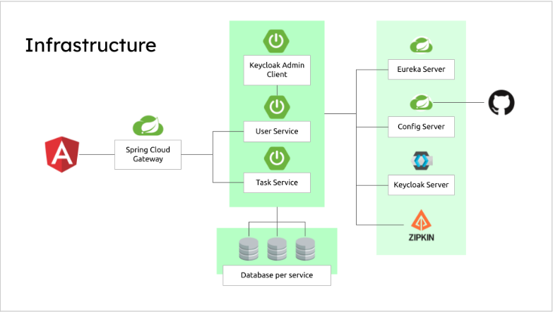

# Microservices ជាមួយនឹង Spring Cloud Advanced Course Mini Project 
# Project នេះ ត្រូវបានរៀចំឡើងដោយ Our beloved teacher 
# លោកសង្ហាររបស់ ពួកយើងខ្ញុំគឺ លោកគ្រូ  Dayan 
# អ្នកគ្រូដ៏ស្អាត របស់ពួកយើងខ្ញុំដែរនោះគឺអ្នកគ្រូ Nich 

## Architecture

Our sample microservices-based system consists of the following modules:
- **gateway-service** - a module that Spring Cloud Netflix Zuul for running Spring Boot application that acts as a proxy/gateway in our architecture.
- **config-service** - a module that uses Spring Cloud Config Server for running configuration server in the `git` mode. The configuration files are placed on the classpath.
- **discovery-service** - a module that depending on the example it uses Spring Cloud Netflix Eureka or Spring Cloud Netlix Alibaba Nacos as an embedded discovery server.
- **user-service** - a module containing the first of our sample microservices that allows to perform CRUD operation on in-memory repository of users
- **task-service** - a module containing the second of our sample microservices that allows to perform CRUD operation on in-memory repository of tasks. It communicates with user-service.

#

ដោយមានការចូលរូមពី សមាជិក Springular (លោកប្រុស `Kim hab` && កូនសិស្ស `Vanrith`) ទាំង២នាក់ពូកយើងបានខិតខំ ព្យាយាម ទាំងកម្លាំងចិត្ត កម្លាំងកាយដើម្បី សម្រេចនូវ កិច្ចការមួយ នេះ យើងសូមអរគុណ លោកគ្រូនឹងអ្នកគ្រូយ៉ាងក្រៃលែង ចំពោះការយកចិត្តទុកដាក់មកលើពូកយើង ។
ហើយយើងមិនភ្លេចអរគុណចំពោះ មិត្តរូមថ្នាក់របស់ យើងផងដែរ ក្នុងការចែករំលែក ចំណេះដឹង នៅមានរឿងមួយទៀតគឺ ctr c && ctr v ដែលមានពួកគាត់ទើបមានយើង អ្នក IT ថ្ងៃនេះ ។

# ជាចុងក្រោយសូមអោយលោកគ្រូអ្នកគ្រូមាន នឹង មិត្តៗទាំងឡាយ សូមអោយមាន សុខភាព ល្អ មុននឹងក្រោយ ក្នុងឪកាស Final Project  ។

